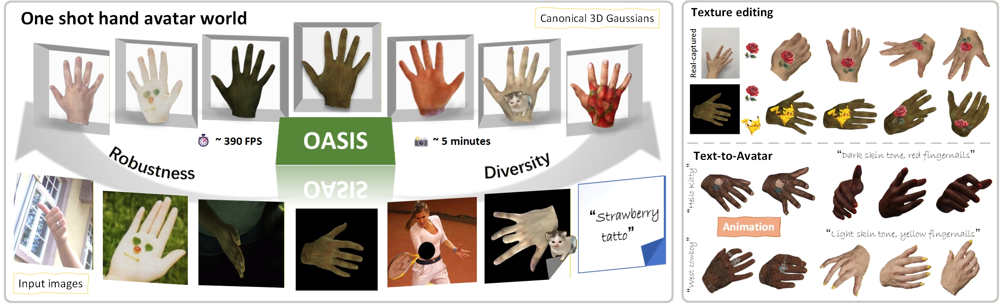

# OASIS: Occlusion-aware Single-image Hand Avatar Reconstruction via 3D Gaussian Splatting

This repository contains the official code release for **OASIS: Occlusion-aware Single-image Hand Avatar Reconstruction via 3D Gaussian Splatting**.

[](https://mova-hand.github.io/MOVA/)

<p align="center">
  
</p>

<p align="center">
  <b>OASIS reconstructs high-fidelity animatable hand avatars from a single image.</b>
</p>

## 🚀 Getting Started

---

### 📢 Updates

---

- [07/2026] Code released.

### ⚙️ Installation

---

We test the CUDA 11.8 environment with Linux, Python 3.10, PyTorch 2.3.0, and torchvision 0.18.0.

```bash
git clone https://github.com/ivyyy77/oasis-hand-code.git
cd oasis-hand-code

conda create -n oasis python=3.10 -y
conda activate oasis

pip install rembg
pip install torch==2.3.0 torchvision==0.18.0 torchaudio==2.3.0 --index-url https://download.pytorch.org/whl/cu118
pip install -U xformers==0.0.26.post1 --index-url https://download.pytorch.org/whl/cu118
pip install -r requirements.txt

pip uninstall basicsr -y
pip install git+https://github.com/XPixelGroup/BasicSR
pip install "git+https://github.com/facebookresearch/pytorch3d.git"
pip install git+https://github.com/hitsz-zuoqi/sam2/
pip install git+https://github.com/ashawkey/diff-gaussian-rasterization/
pip install git+https://github.com/camenduru/simple-knn/
```

### 📦 Required Assets and Models

---

Place the hand model, segmentation, dense-point, and UV assets under the repository root. Prepared examples use MANO annotation pickle files directly, so no separate HaMeR checkpoint is required for the commands below.

Download third-party assets from the official [MANO](https://mano.is.tue.mpg.de/), [SAM 2](https://github.com/facebookresearch/sam2), [Sapiens](https://github.com/facebookresearch/sapiens), and [BiRefNet](https://github.com/ZhengPeng7/BiRefNet) pages, then keep the filenames and folders as below.

```text
checkpoint/
  iteration_30000.ckpt
pretrained_models/
  BiRefNet-general-epoch_244.pth
  dense_sample_points/manohd_semantic.ply
  human_model_files/
    mano/
  mano_subdiv/mano_subdiv_2.pth
  sam2/
  sapiens/pretrained/checkpoints/sapiens_1b/
mano_uv/
  change/change_r.npy
  original mano template/hand.obj
```

### 🧠 Pre-trained Model

---

Use the released OASIS checkpoint as the default prior for reconstruction, evaluation, and finetuning.

```text
checkpoint/
  iteration_30000.ckpt
```

Checkpoints will be distributed through the [OASIS GitHub releases](https://github.com/ivyyy77/oasis-hand-code/releases). The filename is parsed automatically by the scripts, so the iteration number should remain in the checkpoint name.

### 🗂️ Data Preparation

---

Training and evaluation are organized around [InterHand2.6M](https://mks0601.github.io/InterHand2.6M/) 5fps, following the preprocessing pipeline of [HandAvatar](https://seanchenxy.github.io/HandAvatarWeb/) for the detailed data processing steps. For in-the-wild samples, refer to [WiLoR](https://github.com/rolpotamias/WiLoR) for hand localization and reconstruction preprocessing, then convert the WiLoR outputs into the image, mask, and MANO annotation triplets shown below.

```text
${DATA_ROOT}/
  annotations/
    train/InterHand2.6M_train_data.json
    train/InterHand2.6M_train_camera.json
    train/InterHand2.6M_train_joint_3d.json
    train/InterHand2.6M_train_MANO_NeuralAnnot.json
    test/...
  InterHand2.6M_5fps_batch1/
    images/
    masks_removeblack/
    preprocess_ohta_our_full/

example_data/text-to-avatar/
  images/{avatar_3.jpg,iron_man_1.jpg,light_yellow_new.jpg}
  masks/{avatar_3.png,iron_man_1.png,light_yellow_new.png}
  anno/test_Capture0_ROM03_RT_No_Occlusion_cam400272_image15012.pkl
example_data/interhand2.6m/
  images/test_Capture0_ROM03_RT_No_Occlusion_cam400272_image15012.jpg
  masks/test_Capture0_ROM03_RT_No_Occlusion_cam400272_image15012.png
  anno/test_Capture0_ROM03_RT_No_Occlusion_cam400272_image15012.pkl
example_data/editing/
  images/rose.jpg
  masks/{rose.png,rose_edit.png,rose_only.png}
  anno/rose.pkl
```

Generate per-frame InterHand annotations with:

```bash
python generate_interhand_anno.py \
  --dataset-root ${DATA_ROOT} \
  --subject test/Capture0/ROM03_RT_No_Occlusion \
  --phase test \
  --frame test/Capture0/ROM03_RT_No_Occlusion/cam400272/image15012.jpg
```

### ✨ Inference / One-shot Reconstruction

---

For an in-the-wild image, provide a matching mask and MANO annotation in the sibling folders shown above.

```bash
python finetune_wild_id2_ohta.py \
  --input-dir example_data/in_the_wild/images/name.png \
  --checkpoint-file checkpoint/iteration_30000.ckpt \
  --output-path output/finetune \
  --iter=400 \
  --iter_inversion_stage1=200 \
  --animate_to_handavatar=False
```

### 📈 Training and Evaluation

---

The prior training entry is `train_interhand.py`.

```bash
python train_interhand.py infer.hand_lrm model_name=LHM-1B \
  --checkpoint-path checkpoint/interhand \
  --output-path output/interhand \
  --iter=40000
```

Evaluation from the released checkpoint:

```bash
python train_interhand.py infer.hand_lrm model_name=LHM-1B \
  --only_eval \
  --checkpoint-file checkpoint/iteration_30000.ckpt \
  --output-path output/eval_interhand
```

InterHand adaptation and evaluation use `finetune_interhand_ohta.py` with inversion, pseudo-view generation, and pseudo-GT finetuning.

```bash
python finetune_interhand_ohta.py \
  --checkpoint-file checkpoint/iteration_30000.ckpt \
  --output-path output/finetune_interhand_ohta \
  --iter=1200 \
  --use_two_stage_inversion=True \
  --iter_inversion_stage1=100 \
  --iter_inversion_stage2=0 \
  --pseudo-views=8
```

### 🎨 Editing Finetune

---

For texture or text-to-avatar editing, use the edit-specific wild-image entry. Place the edited target in `images/`, the foreground mask in `masks/`, the edit mask as `masks/name_edit.png`, and the MANO annotation in `anno/`.

```bash
python finetune_edit_wild_ohta.py \
  --input-dir example_data/editing/images/pikachu.jpg \
  --checkpoint-file checkpoint/iteration_30000.ckpt \
  --output-path output/finetune_edit \
  --iter=800 \
  --iter_inversion=100 \
  --edit-unmask-iter=0 \
  --edit-mask-weight=30 \
  --pseudo-views=8
```

## 📄 License and Acknowledgements

The released code is provided under the Apache License 2.0. Please also respect the licenses of MANO, InterHand2.6M, and any downloaded third-party model weights.

We thank [LHM](https://github.com/aigc3d/LHM), [3D Gaussian Splatting](https://repo-sam.inria.fr/fungraph/3d-gaussian-splatting/), [HandAvatar](https://seanchenxy.github.io/HandAvatarWeb/), [OHTA](https://github.com/bytedance/OHTA), and [WiLoR](https://github.com/rolpotamias/WiLoR) for their excellent work.

## 📚 Citation

```bibtex
@inproceedings{oasis2026,
  title={OASIS: Occlusion-aware Single-image Hand Avatar Reconstruction via 3D Gaussian Splatting},
  author={Anonymous Authors},
  booktitle={Conference Name},
  year={2026},
  note={Placeholder citation}
}
```
